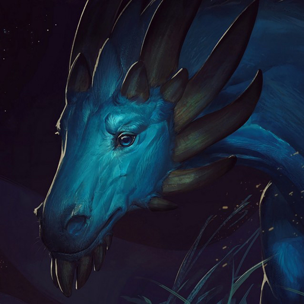
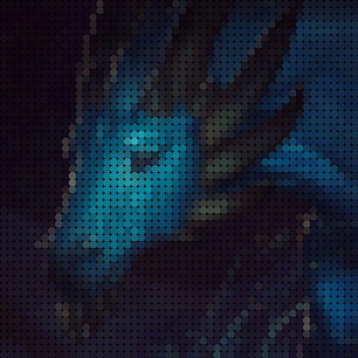

# AI-Art
Reproducing given image using Genetic Algorithm\



## Introduction
In this assignment I use genetic algorithm for testing how good evolution theory is in art field. My program tries to reproduce the piece of art and gets something new, beautiful and awesome. This report briefly describes the work and ideas that were applied in the program.

## How to run the code
1. You need to clone this project on your computer
2. With terminal go to directory AI-Art
3. Download the image you want to see recreated and save it as dragon.jpg in `AI-Art/img/` folder
4. In terminal run
```bash
python program.py
```
5. See your image in `AI-Art/img/result.png`

## What is the representation in your algorithm? 
I decompose my future image into square blocks, and the algorithm tries to choose the most appropriate color for that square block in the sense to maximize a fitness score. So, my individual in the algorithm is an inscribed circle into the square block of some color. It is represented as an array of 3 real-valued numbers in range [0, 255], what is exactly description of color in RGB. As a result, the algorithm composes up all those best individuals, so that there is new piece of art. 

## What is the fitness function?
Mean values on each color channel over the square block of the source image are calculated. Then score(3d distance squared) is calculated between chromosome and mean values. The overall fitness score is calculated as . As a result, we get value between 0 and 1. The closer value to 1, the more appropriate color for future image is selected.

## Which selection mechanism is being used?
Chromosomes with higher fitness score have higher probability to be chosen for next generation. For selection mechanism roulette wheel was picked. 
### Algorithm:
1. We need to calculate total fitness score of population as sum of all fitness scores: , where n is the number of individuals in population, fitness(i) is fitness score of i-th chromosome in population.
2. We need to calculate probability of each chromosome to be selected in new generation: , where i in [0,n].
3. Cumulative probability is need to be calculated: , where i in [0,n].
4. Now for applying roulette wheel technique we need to generate random real value for each chromosome: R(i) in [0,1], where i in [0,n].
5. Then we need to determine which section of cumulative probability function includes R(i), and take corresponding chromosome.

## Explain the crossover function.
In my script the number of mate chromosomes is controlled by CROSSOVER_RATE constant, which is equal to 30%.  Mate chromosomes are chosen randomly. For implementing crossover function one-cut point technique is used. In this technique we need randomly chose the position in parent chromosome and exchange all genes of another parent chromosome from that position.

## Explain mutation criteria.
The number of mutations done in chromosome is controlled by MUTATION_RATE constant, which is equal to 50%. This probability is so high, because of the complex RGB scheme production of color. It is really hard to estimate one channel of color, because we have fitness function calculating score over 3 channels. As a result, it’s more efficient to mutate random gene in hope to pick more appropriate color. It works well actually.

## Which image manipulation techniques have you applied?
My algorithm adds padding by reflecting borders to make the image divisible by square blocks with side equal to GRID_SIZE in px.
